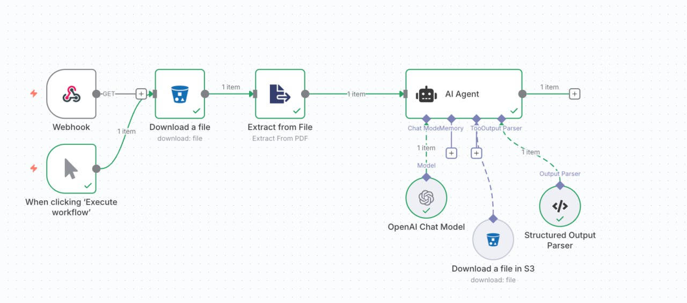
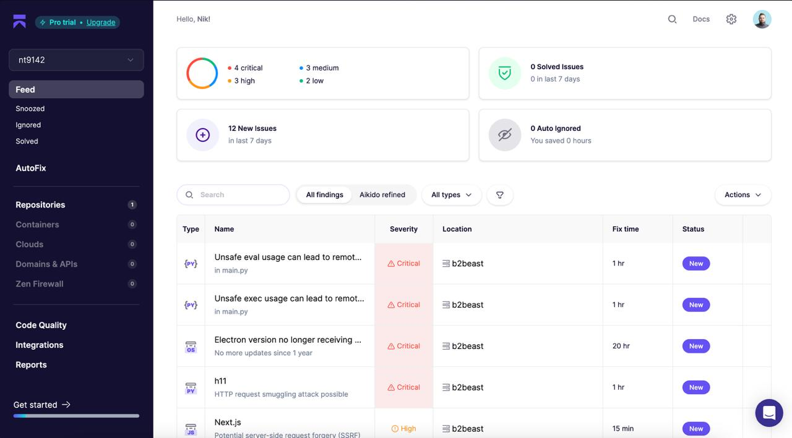
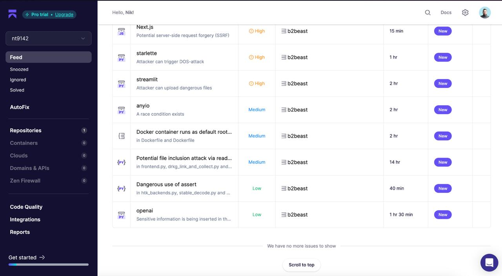

# B2Beast - AI-Powered Contract Analysis Platform

> **Hackathon Submission** | Big Berlin Hack 2024
>
> **Team:** B2Beast
>
> **Date:** October 11-12, 2024 | Berlin
>
> **Challenge:** AI Agents for Legal Workflows
>

## 🚀 Quick Start

Want to run this locally? You'll need:
- **Node.js 18+** and **pnpm**
- **Docker** installed and running (for Cloudflare Containers - no manual setup needed, Wrangler handles it)
- **OpenRouter API Key** (get one free at [openrouter.ai/keys](https://openrouter.ai/keys))

Then run our automated setup script:

```bash
git clone https://github.com/alexkuchun/b2beast.git
cd b2beast
./setup.sh
```

The script will prompt you for your OpenRouter API key and set up everything automatically. After setup completes, run both services:

```bash
# Terminal 1 - Backend API
cd apps/research-api && pnpm run dev

# Terminal 2 - Frontend
cd apps/research-web && pnpm run dev
```

Open http://localhost:3000 and upload a contract to see AI-powered risk analysis in action!

📖 See [detailed installation instructions](#installation) below for manual setup options.

---

## 🎯 Problem Statement

Law is complex and difficult to understand, frequently requiring expensive lawyers to find solutions to legal issues. This prevents many individuals—especially startups and small businesses—from effectively protecting their rights when reviewing contracts and legal documents.

## 💡 Our Solution

B2Beast is an AI-powered contract analysis platform that enables anyone without a law degree to identify risks and problematic clauses in legal contracts. Our system:

- **Intelligent Risk Detection**: Analyzes and highlights potential risks obscured by complex legal language or hidden deep within contracts, making dangerous clauses immediately visible
- **Legal Compliance Verification**: Validates contracts against German Commercial Code (HGB) and Civil Code (BGB) to confirm legal compliance with actual statutes
- **Hallucination Risk Estimation**: Every answer includes an explicit **hallucination probability score** calculated using the HallBayes framework, plus confidence metrics (ISR, information budget) to show how reliable and trustworthy each AI-generated assessment is

## 🏗️ Architecture

This is a **monorepo** built with modern web technologies, containing two main components:

```
b2beast/
├── apps/
│   ├── research-api/          # Cloudflare Workers API with AI workflow orchestration
│   │   └── container/         # Anti-hallucination service (Cloudflare Container)
│   └── research-web/          # Next.js frontend for contract review interface
├── packages/                  # Shared types and utilities
└── prototype/                 # n8n workflow prototype (proof of concept)
```

### **research-api** (Backend API)
- Built on **Cloudflare Workers** for edge computing and global distribution
- **Hono** framework for lightweight, fast API routing
- **Drizzle ORM** with Cloudflare D1 (SQLite) for data persistence
- **AI SDK** for LLM orchestration and streaming responses
- Implements contract parsing, risk analysis, and legal research workflows
- **Cloudflare Containers** for running the Python-based anti-hallucination service

### **research-web** (Frontend)
- **Next.js 15** with React 19 for modern UI
- **TailwindCSS** for styling with **Radix UI** components
- **Lucide React** for iconography
- PDF rendering and annotation with highlighting of risky clauses
- Real-time streaming of AI analysis results

### **container/** (Anti-Hallucination Service)
- Python-based **FastAPI** service running as a **Cloudflare Container** within research-api
- Uses **HallBayes** framework to calculate hallucination probability scores
- Provides ISR (Information Sufficiency Ratio) and information budget metrics
- Load-balanced across multiple container instances for high throughput

## 🛠️ Technology Stack

### Core Technologies

#### **n8n** - Rapid Prototyping
We used **n8n** to build a rapid prototype and validate our core hypotheses before developing the full application. The workflow demonstrated the feasibility of AI-powered contract analysis and informed our production architecture.



*The n8n prototype workflow is available in the [`prototype/`](./prototype) directory.*

#### **OpenAI via OpenRouter**
All AI communications in the API use **OpenAI models** (GPT-4) accessed through **OpenRouter**. This provides:
- Access to multiple AI providers through a unified interface
- Cost optimization and fallback capabilities
- Streaming responses for better UX

Key AI workflows:
- Contract clause risk assessment
- Legal research and case law summarization
- Structured output generation for consistent analysis

#### **Aikido** - Security Analysis
Security is critical when handling legal documents. We integrated **Aikido** for comprehensive security analysis:
- Code vulnerability scanning
- Dependency security audits
- Runtime security monitoring




#### **Lovable** - UI Generation
The frontend interface was initially generated using **Lovable**, which provided:
- Modern, accessible UI components
- Responsive design patterns
- Best-practice React code structure

This accelerated our development and allowed us to focus on the core AI functionality while maintaining a polished user experience.

### Additional Technologies

- **Cloudflare Workers**: Serverless edge computing for low-latency API responses
- **Cloudflare D1**: Distributed SQLite database for storing analysis results
- **Cloudflare R2**: Object storage for uploaded contracts and legal reference materials
- **Drizzle ORM**: Type-safe database access
- **Zod**: Runtime type validation
- **React Query**: Data fetching and caching
- **PDF.js**: Client-side PDF rendering and manipulation

## 🎨 Features

### 1. **Automated Contract Risk Analysis**
- Upload contracts in PDF format
- AI analyzes each paragraph for potential risks
- Severity levels: **High**, **Elevated**, **Medium**, **Safe**
- Highlights problematic clauses directly in the document
- Generates summary that highlights the most important issues

### 2. **Startup-Focused Risk Detection**
Specifically identifies clauses that may harm small businesses:
- Uncapped liability and indemnification
- One-way IP assignment
- Personal guarantees
- Unfavorable payment terms
- Auto-renewal without notice
- Broad audit rights

### 3. **Evidence-Based Analysis**
- Every risk assessment includes exact text snippets from the contract
- Character-level highlighting for precise clause identification
- Clear, plain-language explanations without legal jargon

### 4. **Reliability Assessment**
- Confidence scoring for each analysis to show how reliable the result is
- Hallucination risk estimation using HallBayes probabilistic framework
- Information sufficiency ratio (ISR) calculation to gauge response trustworthiness
- Transparent reliability metrics so users can make informed decisions

### 5. **Legal Research Assistant**
- Search German legal codes (HGB)
- Summarize relevant statutes
- Cross-reference contract clauses with applicable law

## 📋 Requirements

### Hackathon Submission Requirements
✅ Comprehensive README with setup instructions
✅ Clear documentation of all APIs, frameworks, and tools
✅ Sufficient technical documentation for jury evaluation
✅ Anti-hallucination measures implemented
✅ Practical use case: automated contract review

## 🚀 Installation

### Prerequisites

Before you begin, make sure you have:

- **Node.js** 18.0.0 or higher
- **pnpm** package manager
- **Docker** installed and running (Required for Cloudflare Containers)
- **OpenRouter API Key** (Required for AI features)

**Note about Docker:** The anti-hallucination service runs as a Cloudflare Container, which requires Docker to be running on your machine. You don't need to manually run any containers - Wrangler automatically handles container lifecycle management when you run `pnpm dev`.

#### 🔑 Getting Your OpenRouter API Key

You **must** have an OpenRouter API key to use the AI-powered contract analysis features.

1. Visit [OpenRouter.ai](https://openrouter.ai/)
2. Sign up for a free account
3. Navigate to [Keys](https://openrouter.ai/keys) section
4. Click "Create Key" to generate your API key
5. Copy the key (starts with `sk-or-v1-...`)
6. Add credits to your account at [Account Settings](https://openrouter.ai/settings/credits)

**Note:** OpenRouter provides access to multiple AI models including OpenAI GPT-4, Google Gemini, and others through a single API.

### Setup Options

#### Option 1: Automated Setup (Recommended) ⚡

Run the automated setup script that checks all prerequisites and sets up the project:

```bash
git clone https://github.com/alexkuchun/b2beast.git
cd b2beast
./setup.sh
```

The script will:
- ✓ Check Node.js and pnpm installation
- ✓ **Prompt for your OpenRouter API key** and configure `.dev.vars`
- ✓ Install all dependencies
- ✓ Initialize Wrangler state folders
- ✓ Run database migrations
- ✓ Upload legal codes to local R2

**Important:** Have your OpenRouter API key ready! The script will ask for it during setup. Get your key from [OpenRouter.ai/keys](https://openrouter.ai/keys).

#### Option 2: Manual Setup 🔧

1. **Clone the repository**
   ```bash
   git clone https://github.com/alexkuchun/b2beast.git
   cd b2beast
   ```

2. **Install dependencies**
   ```bash
   pnpm install
   ```

3. **Configure API key**
   ```bash
   cd apps/research-api
   cp .dev.vars.example .dev.vars
   ```

   Edit `.dev.vars` and add your OpenRouter API key:
   ```env
   OPENROUTER_API_KEY=sk-or-v1-your-key-here
   CORS_ORIGINS=http://localhost:3000,http://localhost:5173
   ```

4. **Set up database**
   ```bash
   # Generate database schema and run migrations
   pnpm db:generate
   pnpm db:migrate:local
   ```

5. **Set up legal compliance database**

   Upload German legal codes to local R2:
   ```bash
   pnpm r2:upload-legal-codes:local
   ```

   This uploads BGB (Civil Code) and HGB (Commercial Code) to your local R2 mock for contract compliance checking.

### Running the Application

You need to run **two services** simultaneously. Open two terminal windows:

#### Terminal 1: Backend API
```bash
cd apps/research-api
pnpm dev
```
🚀 API runs at `http://localhost:8787`

#### Terminal 2: Frontend
```bash
cd apps/research-web
pnpm dev
```
🚀 Frontend runs at `http://localhost:3000`

**Note:** The anti-hallucination service runs as a Cloudflare Container within the API worker. No separate Python setup is required for local development.

### Quick Start (One-Line Commands)

From the project root, you can also use:
```bash
# Start backend API
pnpm --filter research-api dev

# Start frontend
pnpm --filter research-web dev
```

### Testing the Application

1. Open your browser to `http://localhost:3000`
2. Upload a PDF contract
3. View AI-powered risk analysis with:
   - Highlighted risky clauses
   - Severity ratings
   - Legal compliance verification
   - Confidence scores

## 🧪 Development

This project uses **pnpm** workspaces for monorepo management.

### Project Commands

```bash
# Install all dependencies
pnpm install

# Run specific app
pnpm --filter <app-name> <command>

# Examples:
pnpm --filter research-api dev
pnpm --filter research-web build
pnpm --filter research-api db:generate
```

### Database Commands (research-api)

```bash
cd apps/research-api

# Generate migrations after schema changes
pnpm db:generate

# Apply migrations locally
pnpm db:migrate:local

# Apply migrations to production (Cloudflare)
pnpm db:migrate:remote

# Generate TypeScript types for Cloudflare bindings
pnpm cf-typegen
```

### Cloudflare Deployment

```bash
# Deploy backend API
cd apps/research-api
pnpm deploy

# Deploy frontend
cd apps/research-web
pnpm deploy
```

## 📁 Project Structure

```
b2beast/
├── apps/
│   ├── research-api/           # Backend API
│   │   ├── src/
│   │   │   ├── db/             # Database schema and migrations
│   │   │   ├── routes/         # API endpoints
│   │   │   └── workflows/      # AI workflow orchestration
│   │   ├── container/          # Anti-hallucination service (Cloudflare Container)
│   │   │   ├── src/
│   │   │   │   ├── main.py     # FastAPI service entry point
│   │   │   │   └── hallbayes/  # HallBayes framework for hallucination detection
│   │   │   ├── Dockerfile      # Container image definition
│   │   │   └── requirements.txt
│   │   ├── wrangler.jsonc      # Cloudflare Workers config
│   │   └── package.json
│   │
│   └── research-web/           # Frontend application
│       ├── app/                # Next.js app router
│       ├── components/         # React components
│       └── package.json
│
├── packages/                   # Shared packages
│   └── api-types/              # TypeScript types for API contracts
│
├── prototype/                  # n8n prototype workflow
│   ├── offer-analyze.json      # n8n workflow export
│   └── README.md
│
└── README.md                   # This file
```

## 🤝 Team B2Beast

Built with ❤️ during Big Berlin Hack 2024 by the B2Beast team.

## 📄 License

This project was created for the Big Berlin Hack hackathon.

---

**Note:** This is a hackathon project developed in 24 hours. Some features are in prototype stage and not production-ready.